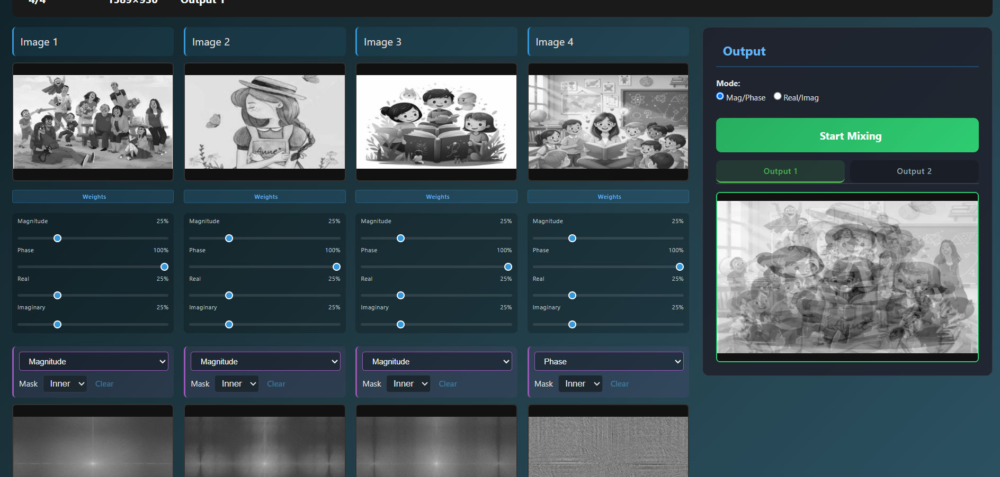
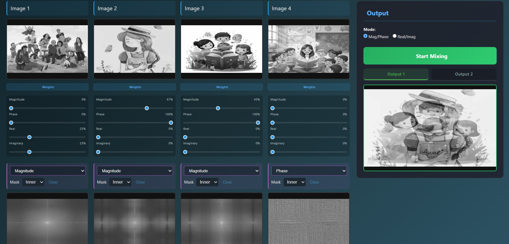
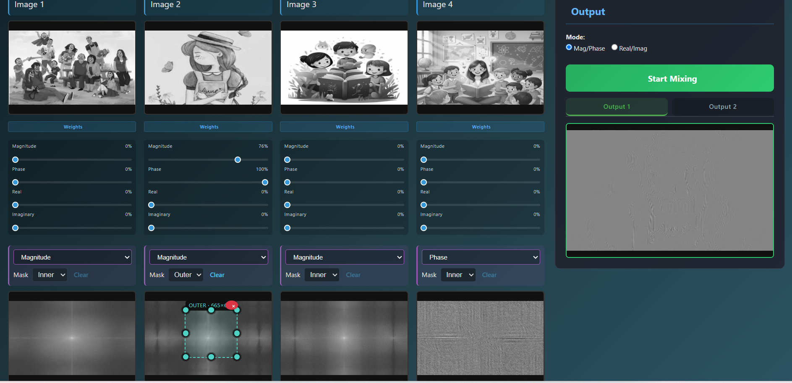
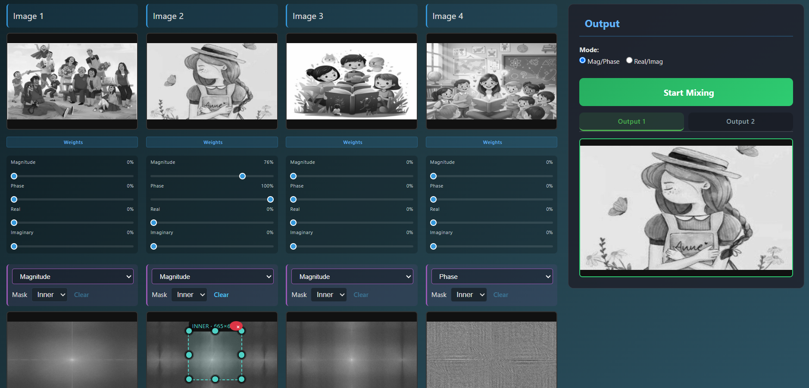
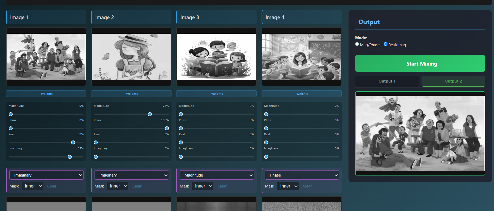

# Fourier Image Mixer

A React and FastAPI application for mixing images in the frequency domain. The application converts uploaded images to grayscale, calculates their 2D Fourier Transform components, lets the user select frequency regions, and reconstructs a mixed image with an inverse Fourier Transform.

## Features

- Upload up to four input images with automatic grayscale conversion.
- Automatically resize all inputs to a shared processing resolution.
- Visualize the 2D Fourier Transform through:
  - Magnitude
  - Phase
  - Real
  - Imaginary components
- Mix images using two Fourier-domain representations:
  - Magnitude/Phase weighting.
  - Real/Imaginary weighting.
- Apply configurable rectangular frequency-region masks:
  - Inner region (low frequencies).
  - Outer region (high frequencies).
- Support two output viewports for displaying and comparing different mixing results.
- Reconstruct mixed images using the inverse 2D Fourier Transform (IFFT).
- Provide real-time mixing feedback with a progress indicator.
- Automatically cancel an ongoing mixing operation when a new mixing request is submitted.
- Preview and compare input/output images and Fourier components.
- Export reconstructed images.
- REST API endpoints for image management, Fourier analysis, masking, and mixing.


## Architecture

```text
Frontend (React + Vite)
        |
        | HTTP / JSON / Multipart
        v
Backend (FastAPI + OpenCV + NumPy)
        |
        v
Image Preprocessing
        |
        v
2D FFT
        |
        +--> Magnitude / Phase
        |
        +--> Real / Imaginary
        |
        v
Frequency Masking + Component Weighting
        |
        v
IFFT Reconstruction
        |
        v
Output Viewport 1 / Output Viewport 2

```

## Requirements

- Node.js and npm.
- Python 3.11 or a compatible Python 3 version.
- A modern browser.

## Project Structure

```text
Frontend/app/
	src/
		App.jsx                 Main user interface and mixing workflow
		services/api.js         Backend API client
		components/             Image viewers and controls
		assets/                 Project screenshots

Backend/
	app/main.py               FastAPI routes
	app/image_manager.py      Image storage, resizing, and orchestration
	app/ft_transformer.py     Fourier calculation, masking, and reconstruction
	requirements.txt          Python dependencies
	run.py                    Backend entry point
```

## Installation

### Backend

From the `Backend` directory:

```bash
py -m pip install -r requirements.txt
```

On systems where `python` is available instead of `py`:

```bash
python -m pip install -r requirements.txt
```

### Frontend

From the `Frontend/app` directory:

```bash
npm install
```

## Running the Project

Start the backend from `Backend`:

```bash
py run.py
```

The backend runs at:

- API: `http://127.0.0.1:5000`
- Swagger documentation: `http://127.0.0.1:5000/docs`

Start the frontend from `Frontend/app`:

```bash
npm run dev -- --host 127.0.0.1 --port 5175
```

Open `http://127.0.0.1:5175/` in the browser.

The frontend API base URL defaults to `http://127.0.0.1:5000/api`. It can be overridden with `VITE_API_BASE` when building or running in another environment.

### Mixing and Output

1. Configure the Fourier component weights.
2. Select either `Magnitude/Phase` or `Real/Imaginary` mode.
3. Optionally define an inner or outer frequency region.
4. Select the desired output viewport.
5. Click `Start Mixing`.
6. Monitor the mixing progress while the IFFT reconstruction is performed.
7. If the mixing settings are changed during processing, the previous operation
   is cancelled automatically and the new request is started.
8. Compare different reconstructed results using the two output viewports.


### Mixing Request

```json
{
	"weights": [
		[1.0, 1.0],
		[0.0, 0.0],
		[0.0, 0.0],
		[0.0, 0.0]
	],
	"rectangles": [null, null, null, null],
	"component_mode": "magnitude_phase",
	"preserve_energy": false
}
```

For `magnitude_phase`, each pair is `[magnitude_weight, phase_weight]`. For `real_imaginary`, each pair is `[real_weight, imaginary_weight]`.

## Test and Validation

The project has been checked with:

- Frontend production build: `npm run build`.
- Backend syntax compilation with `py_compile`.
- Upload tests using images with different dimensions.
- Common-size and resize tests.
- FFT calculation tests.
- Mixing tests in both component modes.
- Inner and outer mask tests, including masks crossing FFT boundaries.
- Invalid image ID and invalid mixing payload tests.

The frontend lint command currently reports existing unused-variable and React hook diagnostics. These do not prevent the Vite production build or the tested upload and mixing workflows.

## Test cases

### Default Four-Image Mixing



### Mixing With Image 2 Emphasis



### Outer Frequency Mask



### Inner Frequency Mask



### Real and Imaginary Mode




